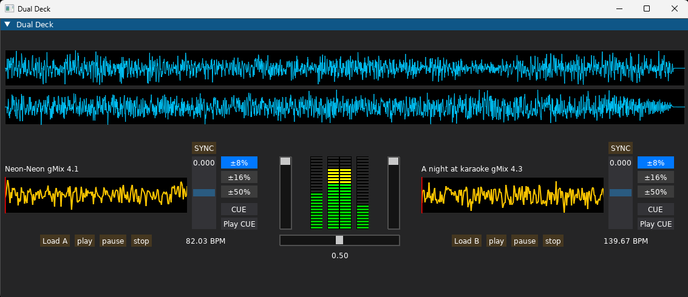

# DJ Mixer (Work in Progress)

A minimal and experimental digital DJ mixer built with Python and DearPyGUI.
The project is still in an early stage, but the foundations are already taking shape:
clean UI, responsive controls, and a simple but solid architecture.

---

## Screenshot

## 🚧 Status: In Construction

This project is actively being developed.
The current version includes:

- Track loading via file dialog

- Global and local waveform visualization

- Minimal crossfader with external value display

- Vertical volume faders

- BPM detection

- Clean track titles (extension removed)

- Modular UI structure

- Basic audio engine with two independent decks

Even in this early phase, the interface already shows the direction:
simple, functional, and inspired by real DJ hardware.

---

## Planned Features

These are some of the improvements and ideas planned for the next iterations:

- Track metadata reading (ID3 tags)

- Sync and beat alignment

- Improved waveform rendering

- Crossfader curve options

- Basic FX module

- Playlist / library panel

- MIDI controller support in the future

- Internal refactoring and better modularity

The goal is not to compete with professional DJ software,
but to build a clean, extensible, and fun mixer with a modern UI.

---

## Vision

A lightweight DJ mixer that:

- feels like hardware

- stays minimal and uncluttered

- is easy to extend

- is enjoyable to hack on

Think of it as a playground for experimenting with DJ concepts, UI design, and audio processing.

--- 

## License

This project is released under the MIT License.

